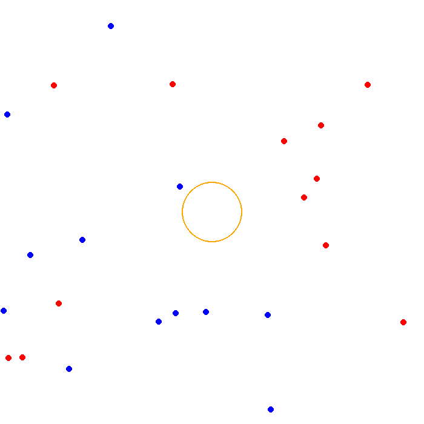
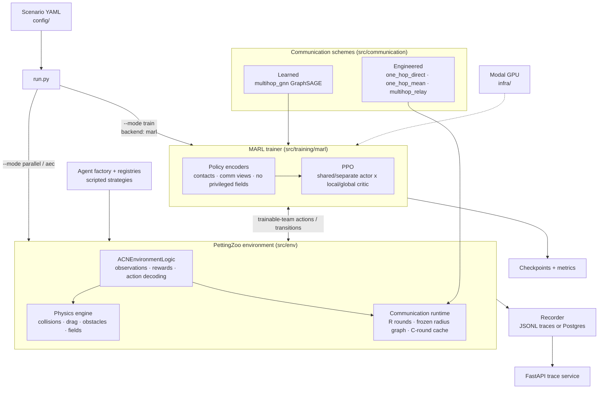

# ACN (Agent Communication Networks)

A multi-agent simulation framework for researching communication protocols, CTDE and distributed control in autonomous agent systems with limited sensing, observability and communication.



*Live simulation (12 blue vs 12 red, `config/readme_demo_config.yaml`): red agents
evade while trying to reach the grid center; blue agents track and pursue them.
Green markers are each blue's VAR-predicted future red positions; the orange
circle marks the central attractor zone. Regenerate with
`uv run python run.py --mode parallel --config config/readme_demo_config.yaml`.*

## Overview

ACN is built on [PettingZoo](https://github.com/Farama-Foundation/PettingZoo) and provides:

* **Blue Agents**: Defensive units with VAR-based prediction models to forecast red agent movements
* **Red Agents**: Mobile units with configurable movement strategies
* **Physics Package**: Integrated 2D physics helpers with collisions, drag, obstacles, and force fields
* **Communication**: A synchronous round-based runtime (R rounds per movement step over a
  frozen same-team radius graph, C-round message cache) with named schemes from engineered
  one-hop delivery to multi-hop relay and learned GraphSAGE message passing
* **Limited Sensing**: Config-gated bearing-only blue sensor producing anonymous contact
  reports, with ground-truth identities preserved for evaluation only
* **MARL Training**: A TorchRL-backed MAPPO/IPPO trainer supporting both learning
  directions — learned blue vs scripted red, or learned red vs the scripted
  VAR-pursuit blue — with exactly one trainable team per run
* **Run Traces**: Training-oriented traces for observations, actions, rewards, states, and blue-agent prediction events, written either as local JSONL files or directly to Postgres
* **Benchmarking**: Scenario-comparison scaffolding and basic metrics

## Features

### Agent Types

Either team can be driven two ways: by a **scripted strategy** configured per agent
group (tables below), or by the **MARL trainer**, which bypasses strategies entirely
and supplies the trainable team's actions each step (see Training).

| Agent | Description |
|-------|-------------|
| **Blue** | Defensive/tracking agent. Scripted blues use Vector Auto-Regressive (VAR) models to predict red trajectories and pursue them; a learned blue is trained by the MARL trainer instead (optionally under bearing-only sensing and communication). |
| **Red** | Mobile agent whose objective is reaching the scoring ring undetected. Scripted reds can pursue, avoid, flock, or target the grid center; a learned red is trained by the MARL trainer. |

### Red Agent Strategies

Located in `src/agents/strategies/`:

| Strategy | Description |
|----------|-------------|
| `center` | Move toward grid center, maintaining 10-unit minimum distance (default) |
| `avoidant` | Detect and steer away from blue agents |
| `aggressive` | Pursue the nearest blue agent |
| `team` | Move toward average position of visible red teammates |
| `flocking` | Full boids-style behavior (cohesion, alignment, separation) |
| `trainable` | No scripted behavior; actions are supplied externally (the MARL trainer drives every trainable-team agent regardless of its configured strategy) |

### Blue Agent Strategies

Located in `src/agents/blue_strategies/`:

| Strategy | Description |
|----------|-------------|
| `static` | Remain stationary, continue tracking |
| `pursuit` | Move toward average VAR-predicted red position (the scripted opponent baseline when red is the trainable team) |

Blue has no `trainable` strategy entry: when blue is the trainable team the
trainer supplies actions directly and the configured strategy is never invoked.

### Communication Schemes

Located in `src/communication/`. Every scheme compiles to a `CommunicationPlan`
(topology + transport + processor) over one shared synchronous slotted-radius
transport; delivery semantics never depend on the processing backend:

| Scheme | Description |
|--------|-------------|
| `none` | No communication; agents receive an explicit empty view |
| `one_hop_direct` | One-hop delivery of engineered bearing reports; distinct inbox preserved |
| `one_hop_mean` | One-hop delivery + PyG aggregation (mean/sum/max) to one vector per agent |
| `multihop_relay` | First-seen unchanged packet forwarding with TTL, duplicate suppression, and cross-step carryover (requires cache window >= TTL) |
| `multihop_gnn` | Learned GraphSAGE message passing (R rounds = R layers), trained end to end inside the actor; never executed by the environment |

See `docs/communication_decision_log.md` for the design record and
`docs/configuration.md` for the config schema.

### Training

Located in `src/training/`. There is no "learning agent" class: the learner
lives in the trainer, which binds a PPO policy to whichever team
`training.trainable_team` names and drives that team's actions, while the
opposing team's agent objects run their scripted `choose_action` unchanged.
Exactly one team is trainable per run (`blue` XOR `red`; configs naming both
or neither are rejected).

| Direction | Config | Learner | Scripted opponent |
|-----------|--------|---------|-------------------|
| Blue learns | `config/benchmark_blue_mappo.yaml` | Blue: bearing-only sensing, `one_hop_mean` comms, benchmark tracking reward | Avoidant reds |
| Blue learns (learned comms) | `config/benchmark_blue_mappo_gnn.yaml` | As above with end-to-end GraphSAGE communication | Avoidant reds |
| Red learns | `config/benchmark_red_mappo.yaml` | Red: benchmark dwell/evasion reward | VAR-pursuit blues (privileged observation channel) |

The training stack is deliberately **algorithm-agnostic**: the common method
interface, the per-step transition contract, and the discrete action space form
a fixed comparison surface so that training algorithms — policy-gradient,
value-based, model-based, or non-gradient baselines like the VAR controller —
can be benchmarked against each other on identical scenarios, observations, and
rewards. PPO is the first implementation; new algorithms plug into the same
interface without touching the environment API.

Components:

* `src/training/marl/`: The TorchRL-backed team-selection trainer
  (`training.backend: "marl"`). One PPO implementation covers shared/separate
  actors x local/global critics (MAPPO with a privileged central critic is the
  benchmark default; shared-actor IPPO is the control). Fully seeded, headless,
  checkpoint/resume-capable.
* `src/training/trainer.py`: The legacy Stable-Baselines3 PPO path, kept for
  backward compatibility.

Remote training runs on Modal (`infra/`); the same config trains on GPU
remotely and debugs on CPU locally (`training.device: "auto"`).

### Implementation Status

Implemented and verified (every claim gated by tests and golden-trace
regression):

* All five communication schemes, wired into the parallel environment
  (differentiable schemes run inside the actor, never in the environment).
* Bearing-only sensing, discrete action space, and benchmark rewards — each
  config-gated; defaults reproduce legacy behavior exactly.
* Both learning directions train: learned blue improved its tracking reward in
  a 50-update GPU run; learned red improves against a scripted blue in the
  seeded learning-sanity tests. Neither has had a full-length training
  campaign yet.

Not yet implemented: the frozen benchmark scenario manifest and the
communication ablation study; communication as an explicit RL action
(message-action heads); protocol realism (loss, delay, bandwidth,
fragmentation); asynchronous/event-driven communication; self-play.

## Quick Start

```bash
# Install dependencies
uv sync

# Run the default parallel simulation
uv run python run.py --mode parallel

# Persist a run directly to Postgres instead of writing JSONL trace files
uv run python run.py --mode parallel --config config/experiment_config.yaml --persist

# Specify config
uv run python run.py --mode parallel --config config/aggressive_config.yaml

# Run AEC mode
uv run python run.py --mode aec --config config/experiment_config.yaml

# Train (MARL benchmark configs; legacy SB3 configs route automatically)
uv run python run.py --mode train --config config/benchmark_blue_mappo.yaml

# Remote training on Modal (see infra/README.md for the one-time setup)
uvx modal run infra/modal_train.py::train --config config/benchmark_blue_mappo.yaml

# Merge gate: lint + full test suite + golden-trace regression
./scripts/gate.sh

# Inspect one blue agent from a completed run
uv run python -m src.analysis.blue_history \
  --run-dir results/avoidant/avoidant_strategy_scaled_YYYYMMDD_HHMMSS_parallel \
  --blue-agent blue_0 \
  --plot trajectory
```

## Trace API

Run Postgres and the ACN trace API:

```bash
docker compose up --build
```

The API is served on `http://localhost:8000`. With `--persist`, simulations
write directly to Postgres using a UUID `run_id`; no `trace/*.jsonl` files are
created for that run.

Without `--persist`, simulations write timestamped local run folders under
`results/.../<run_id>/trace/`. Those local runs can still be ingested later:

```bash
curl -X POST http://localhost:8000/ingest \
  -H "Content-Type: application/json" \
  -d '{"run_dir": "/app/results/experiment/basic_comm_test_YYYYMMDD_HHMMSS_parallel"}'
```

Useful endpoints:

* `GET /runs`
* `GET /runs/{run_id}/agents`
* `GET /runs/{run_id}/transitions?agent_id=blue_0`
* `GET /runs/{run_id}/events?event_type=prediction&source_agent_id=blue_0`
* `GET /runs/{run_id}/trajectory?agent_id=blue_0`
* `POST /runs/{run_id}/plots`

You can also ingest from the host Python environment:

```bash
uv run python -m src.storage.ingest \
  --run-dir results/experiment/basic_comm_test_YYYYMMDD_HHMMSS_parallel
```

## Architecture



Engineered communication executes inside the environment step; the learned
`multihop_gnn` scheme executes inside the trainer's actor forward pass — the
environment never runs differentiable communication.

## Project Structure

```
acn/
├── src/
│   ├── agents/           # Agent implementations
│   │   ├── base_agent.py
│   │   ├── blue_agent.py
│   │   ├── red_agent.py
│   │   ├── factory.py    # Agent creation from config
│   │   ├── registry.py   # Strategy registration
│   │   ├── strategies/   # Red agent behaviors
│   │   └── blue_strategies/  # Blue agent behaviors
│   ├── env/              # PettingZoo environments
│   │   ├── aec_env.py    # Alternating agent order
│   │   ├── parallel_env.py  # Simultaneous steps
│   │   ├── common_env_logic.py  # Shared logic
│   │   ├── observation.py  # Builder pattern for obs
│   │   └── rewards.py    # Reward functions
│   ├── physics/          # Physics simulation
│   │   ├── engine.py     # Euler integration, collisions
│   │   ├── obstacles.py  # Rect, Circle obstacles
│   │   └── fields.py     # Force fields
│   ├── communication/    # Schemes, topology, transport, round runtime, processors
│   ├── training/         # MARL trainer (marl/) + legacy SB3 path
│   ├── benchmark/        # Performance metrics
│   ├── analysis/         # Run trace inspection and plotting utilities
│   ├── api/              # FastAPI trace service
│   ├── storage/          # Postgres schema, direct persistence, and ingestion utilities
│   └── utils/            # Logging, config, geometry
├── config/               # YAML configs (incl. benchmark_*_mappo.yaml)
├── tests/                # Unit tests
├── docs/                 # Full documentation
├── infra/                # Modal remote-training harness
├── scripts/              # Merge gate + golden-trace harness
├── run.py                # Unified entry point
├── main.py               # Deprecated AEC wrapper
└── main_parallel.py      # Deprecated parallel wrapper
```

## Configuration

Create `.env` from `.env.example`:

```bash
cp .env.example .env
```

Key settings:
* `ACN_CONFIG_PATH`: Default config file
* `ACN_RESULTS_DIR`: Output directory

Config format (`config/*.yaml`):

```yaml
experiment_name: "flocking_strategy"
results_base_dir: "results"

agents:
  blue_agents:
    - count: 5
      communication_bandwidth: 15
      processing_capability: 2
      detection_radius: 100.0
      strategy_type: "pursuit"
      prediction_interval: 10

  red_agents:
    - count: 30
      communication_bandwidth: 5
      processing_capability: 3
      detection_radius: 200.0
      strategy_type: "flocking"
      cohesion_weight: 15.0
      alignment_weight: 15.0
      separation_weight: 15.0
      separation_radius: 15.0
      max_speed: 5.0
      min_speed: 2.0
      max_force: 0.2
      wall_avoidance_weight: 5.0
      wall_detection_radius: 200.0

environment:
  width: 300
  height: 300
  max_cycles: 1550
  render_mode: "human_pygame"
  save_episode_gifs: true

analysis:
  trace:
    enabled: true
  plots:
    generate_after_run: false
```

Current implementation note: the default AEC/parallel environments now route movement
through `PhysicsEngine`. The legacy direct-kinematic path is still available with
`environment.physics.enabled: false`. The reward factory and GNN communication model
are present as extension modules, but the default environments still use hard-coded
attractor scoring and no learned message passing.

By default, completed runs write local trace files under `trace/` in the run
directory. Bulk prediction plot generation is opt-in through
`analysis.plots.generate_after_run: true`; use `src.analysis.blue_history` to
recreate individual blue-agent histories and generate targeted plots on demand.

## Testing

```bash
# Run all tests
uv run python run_tests.py

# Run specific module
uv run python -m pytest tests/test_physics.py -v
```

## Documentation

Full Markdown documentation is available in the `docs/` directory:

* [Installation](docs/installation.md)
* [Architecture](docs/architecture.md)
* [Agents](docs/agents.md)
* [Environment](docs/environment.md)
* [Physics](docs/physics.md)
* [Configuration](docs/configuration.md)
* [Strategies](docs/strategies.md)
* [API Reference](docs/api.md)
* [Development](docs/development.md)

The Markdown files can be read directly in GitHub or VS Code. Optionally, build
an HTML site with Sphinx:

```bash
uv run --with sphinx --with sphinx-rtd-theme --with myst-parser sphinx-build -b html docs docs/_build
```

## Future Work

- [ ] Integrate explicit communication channels and learned message policies
- [ ] Add CTDE baselines such as MAPPO/MADDPG-style centralized critics
- [ ] Wire modular rewards into the PettingZoo environments
- [ ] Add scenario-level physics sweeps for inertia, obstacles, collisions, and fields
- [ ] Build benchmark scenarios and statistical reporting for communication utility
- [ ] Add opponent/world-model baselines for prediction under partial observability
