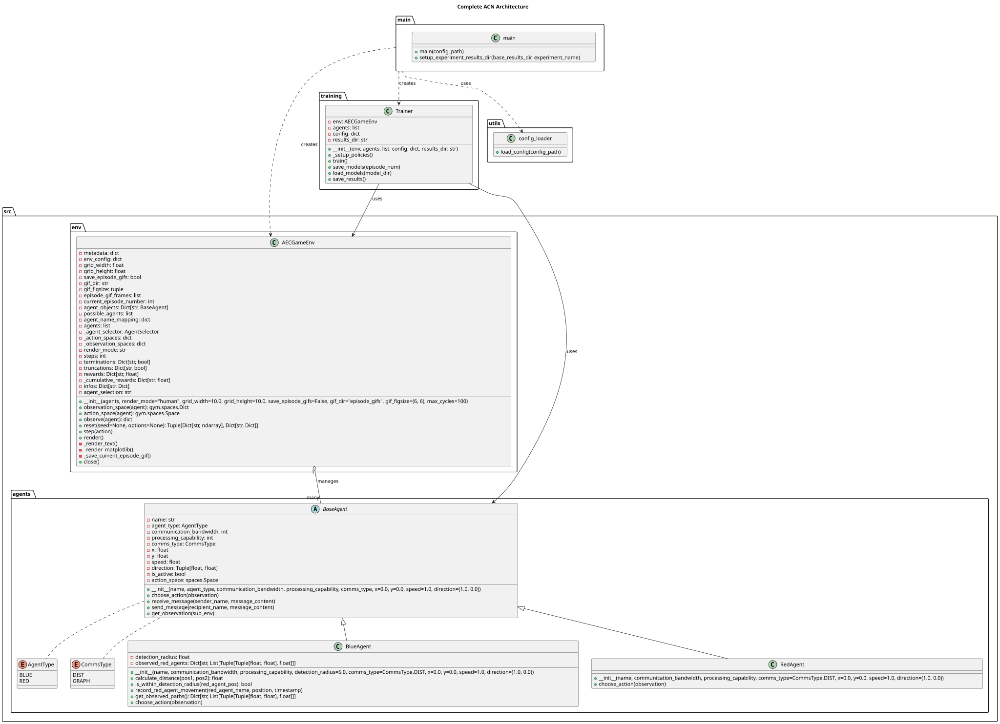

# ACN Documentation

**Agent Communication Networks (ACN)** is a multi-agent simulation framework
designed for researching communication protocols and distributed control
mechanisms in autonomous agent systems.



## Overview

ACN provides a PettingZoo-based environment where:

* **Blue Agents** are defensive agents with VAR-based prediction models to track red agents
* **Red Agents** are mobile agents with configurable movement strategies
* Agents can be configured into partially observable pursuit/evasion and flocking scenarios

The framework supports both parallel and AEC (Agent Environment Cycle) API modes,
making it suitable for simulation experiments and as a foundation for multi-agent
reinforcement learning research. Learned communication, centralized critics,
modular reward selection, and richer scenario-level physics controls are active
extension areas rather than complete runtime features.

## Quick Start

```bash
# Install dependencies
uv sync

# Run simulation
uv run python run.py --mode parallel

# Or specify a config
uv run python run.py --mode parallel --config config/aggressive_config.yaml

# Persist trace data directly to Postgres
uv run python run.py --mode parallel --config config/experiment_config.yaml --persist
```

## Contents

* [Installation](installation.md)
* [Google Cloud Setup](gcp_setup.md)
* [Architecture](architecture.md)
* [Agents](agents.md)
* [Environment](environment.md)
* [Physics](physics.md)
* [Configuration](configuration.md)
* [Strategies](strategies.md)
* [API Reference](api.md)
* [Development](development.md)
